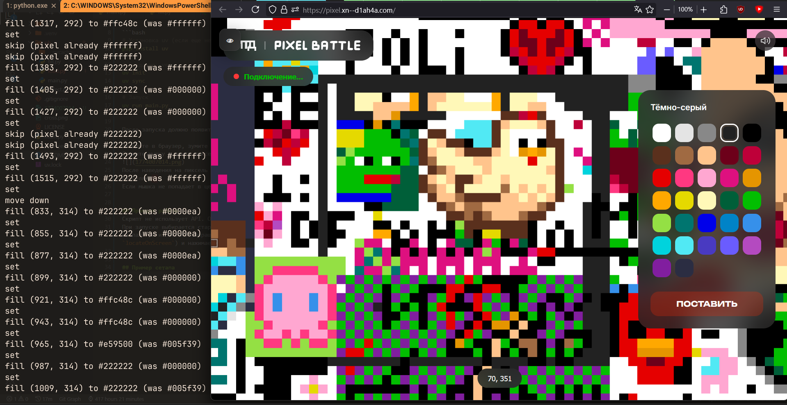

# itd-pb

Скрипт для пиксельбатла итд.
> [!CAUTION]
> Проект закрыт (ну типо пб закончился)

## Запуск
В файле `pb/main.py` в переменную `PATH` ставите путь к файлу.

```bash
# Установка uv (если еще нету)
pip install uv

# Создание .venv
uv init
uv sync

# Запуск
uv run main.py
```
После запуска должно появиться `accounts: `
Вписываете количество аккаунтов, после чего попросит выбрать расположение вкладок для каждого аккаунта (наводитесь на вкладку в бразуере с этим аккаунтом и нажимаете `Shift`). Вкладки браузеров должны быть одинаковые (та же позиция и зум).

Когда появится сообщение `select top left pixel`, зумите так, чтобы пиксель был примерно размером с мышь.  
Ставите мышку в центр левого верхнего пикселя, откуда начинается рисунок.


После наведения на пиксель нажимаете на Shift. В консоли должно появиться `selected: (КООРДИНАТЫ МЫШКИ)`. Тоже самое делаете с правым верхним углом; мышка начнет двигаться по пикселям.  


## Принцип работы
Скрипт не использует API. Он просто двигает мышку по пикселям.  
При запуске выбирается стартовый пиксель, после чего каждый пиксель сверяется с данной картинкой, и если цвета не совпадают, то выбирается цвет из палитры и пиксель закрашивается. Также если при нажатии на пиксель открылось окно с информацией, скрипт ищет крестик (через `locateOnScreen`) и нажимает на него.


## Пример сетапа

Бразуер раскрыт примерно на 2\3, чтобы было видно логи с консоли.

## Разбор логов
### `fill (КООРДИНАТЫ) to #НОВЫЙ_ЦВЕТ (was #ЦВЕТ)`
Заливка пикселя по коодинатам по координатам КООРДИНАТЫ с ЦВЕТ на НОВЫЙ ЦВЕТ

### `skip (pixel already #ЦВЕТ)`
Пропуск пикселя (пиксель уже в нужном цвете)

### `set`
Установка пикселя

### `move down`
Переход на следующий уровень по Y

### `no cross`
Крестик не обнаружен
